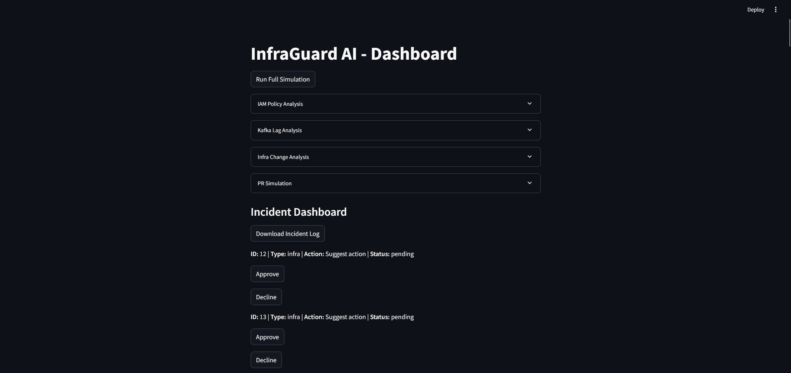
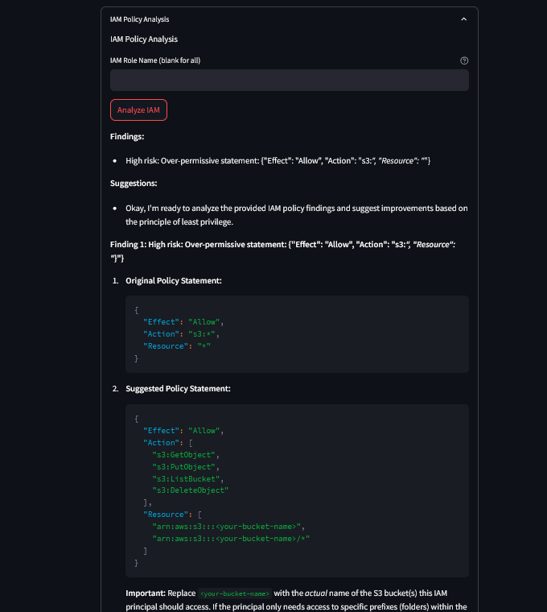
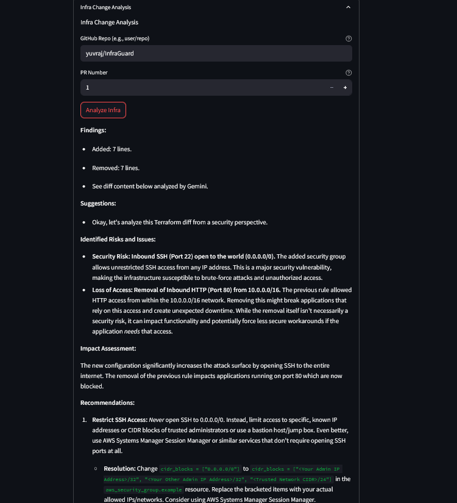
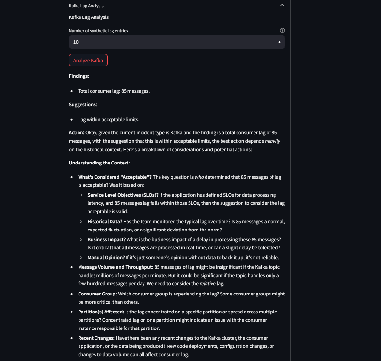
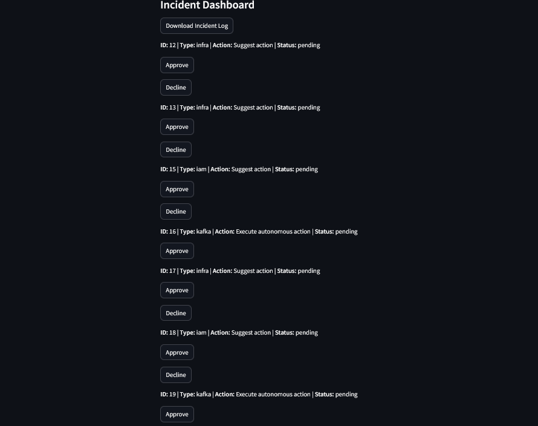
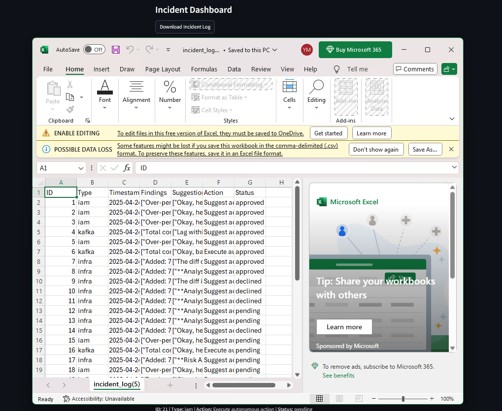

# 🛡️ InfraGuard AI

InfraGuard AI is an intelligent infrastructure analysis and incident management system that enhances security and performance across AWS IAM policies, Kafka consumer lag, and Terraform infrastructure changes.
It uses the **Gemini API** for natural language processing and **Streamlit** for an intuitive UI—automating risk detection, resolution suggestions, and incident tracking.

---

## ✨ Features
- **IAM Policy Analysis**: Detects over-permissive AWS IAM policies and suggests least-privilege alternatives.
- **Kafka Lag Analysis**: Analyzes synthetic Kafka consumer lag data to detect bottlenecks and recommend optimizations.
- **Infra Change Analysis**: Reviews Terraform diffs from GitHub PRs to flag risks and suggest secure configurations.
- **Incident Management**: Track and manage incidents via a Streamlit dashboard with downloadable logs.
- **Automated Notifications**: Sends alerts to Microsoft Teams for critical actions.
- **Simulation Mode**: Run a full analysis across all modules with one click.

---

## 🧩 Implemented Components
- `app.py`: Central dashboard (Streamlit UI).
- `infraguard.db`: SQLite database using SQLAlchemy.
- `iam_analyzer.py`: AWS IAM policy analysis using `boto3`.
- `kafka_explainer.py`: Synthetic Kafka lag data generation and analysis.
- `infra_summarizer.py`: Terraform PR diff analysis using `PyGithub`.
- `decision_engine.py`: Risk scoring logic and action decisions.
- `action_generator.py`: Generates PR content and Teams notifications.
- `main.py`: Coordinates full simulation.

All analysis modules use **LangChain's `ConversationBufferMemory`** to maintain conversation context.

---

## ⚙️ Technologies Used
- Python 3.8+
- [Streamlit](https://streamlit.io)
- [Gemini API](https://aistudio.google.com/app/prompts)
- SQLAlchemy
- `boto3` (AWS SDK for IAM)
- `PyGithub` (GitHub API)
- `requests` (for Teams Webhook)
- `pandas` (for CSV logs)
- `Langchain` (memory & conversational logic)

---

## 🚀 Setup Instructions
### 1. Clone the Repository
```bash
git clone https://github.com/your-repo/infraguard-ai.git
cd infraguard-ai
```

### 2. Install Dependencies
```bash
pip install -r requirements.txt
```

### 3. Set Environment Variables
Add the following to a .env file or export in your shell:
```
GEMINI_API_KEY=your_gemini_key
AWS_ACCESS_KEY_ID=your_aws_key
AWS_SECRET_ACCESS_KEY=your_aws_secret
GITHUB_TOKEN=your_github_token
TEAMS_WEBHOOK_URL=your_teams_webhook
```

### 4. Run the App
```bash
streamlit run app.py
```

---

## 💡 Usage
- **Login**: Use admin/password to access the dashboard.
- **Run Simulation**: Click "Run Full Simulation" for end-to-end analysis.
- **Custom Analysis**: Expand IAM / Kafka / Infra sections to run individual tests.
- **Incident Handling**: Approve or reject incidents, and export logs to CSV.

---

## 🧠 Incident Workflow
- **Detection**: Issues flagged by analysis modules.
- **Decision**: Risk scores determine "Execute", "Escalate", or "Suggest".
- **Notification**: "Execute" actions trigger Teams alerts.
- **Management**: Incidents are logged and viewable on the dashboard.

---

## 📜 Logging
All key events and actions are logged to infraguard.log for audit purposes.

---

## 🔮 Future Enhancements
- Integrate real Kafka metrics.
- Add OAuth-based login system.
- Optimize system for large-scale incident handling.

## 📸 Screenshots

### Login Page


### Dashboard UI


### IAM


### infra


 ### Kafka Lag


 ### PR review


### Incident-Dashboard


### Downloaded logs



